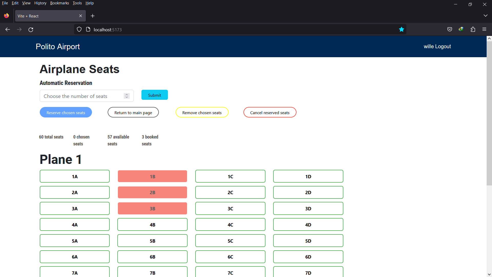

# Exam #2: "Airplane Seats"

## Student: s308066 FEKRI FARISAN 

# Server side

## API Server

- POST `/api/login`
  - request parameters: username, password
  - This request expects a successful response with JSON data containing information about the logged-in user from the API server. Otherwise, it throws an error with the error message received from the server.
- POST `api\logout`
  - request parameters: None
  - This request expects a successful response with an HTTP status code indicating a successful logout from the API server. Otherwise, it throws an error with the error message received from the server.
- GET `/api/planes`
  - request parameters: None
  - This request retrieves a list of planes and responds with the retrieved data in JSON format from an API server if successful. Otherwise, it sends an appropriate HTTP status code and the error message as the response body.
- GET `/api/seats/:planeId`
  - request parameters: planeId
  - This request retrieves a list of seats based on the provided idPlane parameter value and responds with the retrieved data in JSON format from an API server if successful. Otherwise, it sends an appropriate HTTP status code and the error message as the response body.
- PUT `/api/submission`
  - It requires the user to be logged.
  - request parameters: plane, seats
  - This request reserves seats for a user in an API server. It handles the seat reservation logic and server responds with appropriate status codes and JSON data based on the success or failure of the seat reservation process.
- DELETE `/api/cancellation`
  - It requires the user to be logged.
  - request parameters: plane
  - requests canceling a reservation for a user in an API server. It handles the cancellation logic and server responds with appropriate status codes and JSON data based on the success or failure of the cancellation process.

## Database Tables

- Table `users` - contains id email name salt password
- Table `planes` - contains id name type
- Table `seats` - contains seat idPlane idUser

# Client side

## React Client Application Routes

- Route `/`: main page where planes and seats are visualized 
- Route `/login`: the login page where user can be authenticated 

## Main React Components

- `App` (in `App.jsx`): Where logic of our application and the main components are defined and basically the father of all components
- `Mainpage` (in `Mainpage.jsx`): It will decide the content of the main page based on whether the user has requested the list of planes or the list of seats on an specifc plane
- `Visualize` (in `Visualize.jsx`): The display of all seats on a specific plane where the main functionalities like reservation and cancellation takes place
- `Rowmap` (in `Rowmap.jsx`): Access to each row in the airplane
- `Colmap` (in `Colmap.jsx`): Access to each element of each row in the airplane where an specific seat in an specific plane can be reached. This component is the child of all the components above and the functionalities like the status of each seat (free, occupied, reserved) is defined

# Usage info

## Example Screenshot

## Users Credentials

- zahra@test.com, pwd (This user has three seats reserved on plane 1)
- wille@test.com, pwd (This user has three seats reserved on plane 2)
- simon@test.com, pwd 
- lorenzo@test.com, pwd (This user has three seats reserved on plane 3)
- chloe@test.com, pwd 
